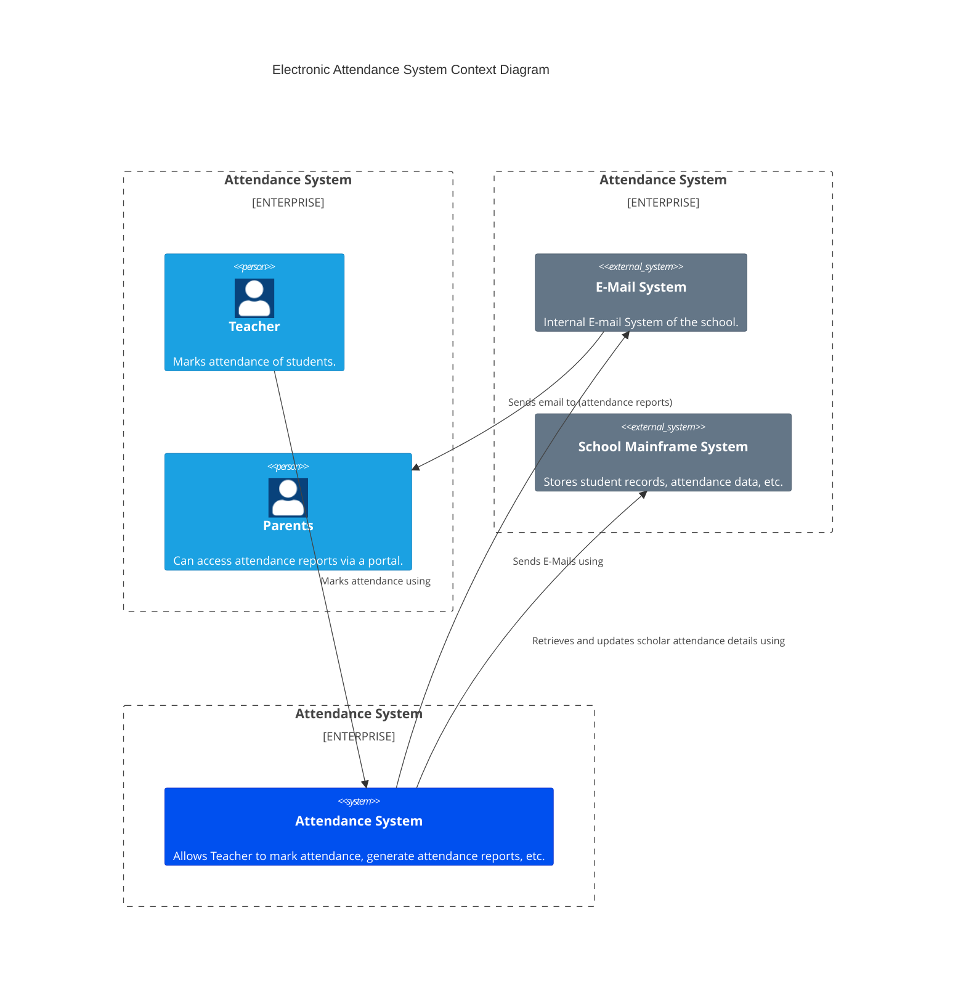
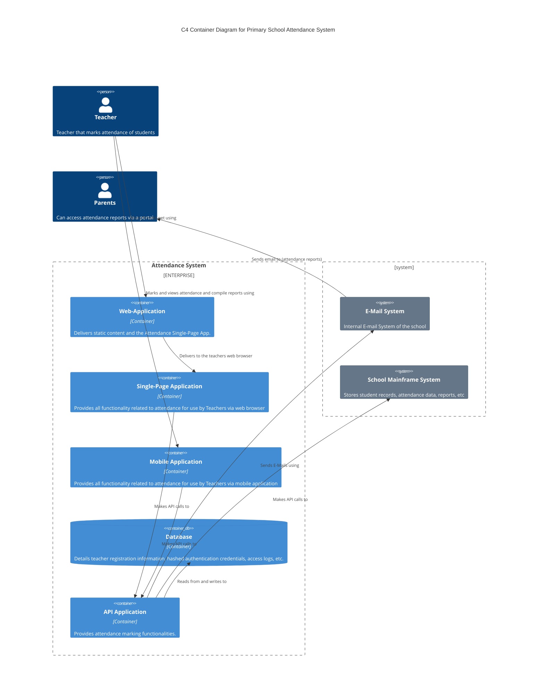
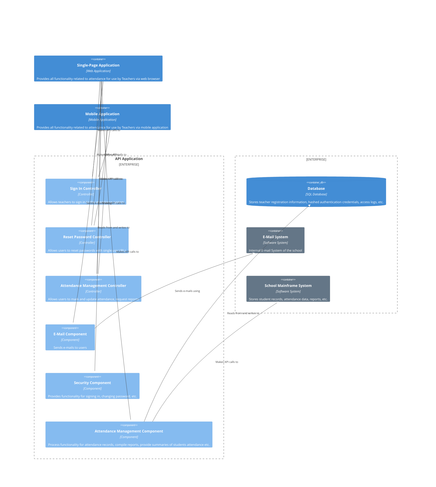
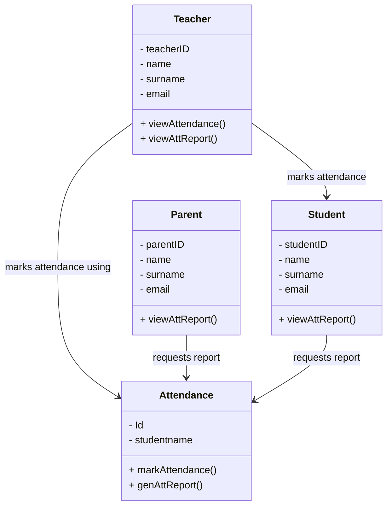

# Electronic Attendance System

## System Context Diagram

```mermaid
C4Context
  title Electronic Attendance System Context Diagram
  Enterprise_Boundary(b0, "Attendance System") {
    Person(teacher, "Teacher", "Marks attendance of students.")
    Person(parents, "Parents", "Can access attendance reports via a portal.")
  }
    Enterprise_Boundary(b3, "Attendance System"){
    System_Ext(emailSystem, "E-Mail System", "Internal E-mail System of the school.")
    System_Ext(schoolMainframe, "School Mainframe System", "Stores student records, attendance data, etc.")
  }
      Enterprise_Boundary(b1, "Attendance System"){
    System(attendanceSystem, "Attendance System", "Allows Teacher to mark attendance, generate attendance reports, etc.")
}

  Rel(teacher, attendanceSystem, "Marks attendance using")
  Rel(attendanceSystem, schoolMainframe, "Retrieves and updates scholar attendance details using")
  Rel(attendanceSystem, emailSystem, "Sends E-Mails using")
  Rel(emailSystem, parents, "Sends email to (attendance reports)")

  UpdateElementStyle(teacher, $bgColor="#1ba1e2", $fontColor="white", $borderColor="#006EAF")
  UpdateElementStyle(attendanceSystem, $bgColor="#0050ef", $fontColor="white", $borderColor="#001DBC")
  UpdateElementStyle(schoolMainframe, $bgColor="#647687", $fontColor="white", $borderColor="#314354")
  UpdateElementStyle(parents, $bgColor="#1ba1e2", $fontColor="white", $borderColor="#006EAF")
  UpdateElementStyle(emailSystem, $bgColor="#647687", $fontColor="white", $borderColor="#314354")
```

## Container Context Diagram

```mermaid
C4Context
    title C4 Container Diagram for Primary School Attendance System
    Person(person_teacher, "Teacher", "Teacher that marks attendance of students")
    Person(person_parents, "Parents", "Can access attendance reports via a portal")
    
    Enterprise_Boundary(b0, "Attendance System") {
        Container(web_application, "Web-Application", "Container", "Delivers static content and the Attendance Single-Page App.")
        Container(spa, "Single-Page Application", "Container", "Provides all functionality related to attendance for use by Teachers via web browser")
        Container(mobile_app, "Mobile Application", "Container", "Provides all functionality related to attendance for use by Teachers via mobile application")
        ContainerDb(database, "Database", "Container", "Details teacher registration information, hashed authentication credentials, access logs, etc.")
        Container(api_app, "API Application", "Container", "Provides attendance marking functionalities.")
    
    }

    Boundary(b1, ""){
    
    System(email_system, "E-Mail System", "Internal E-mail System of the school")
    System(school_mainframe, "School Mainframe System", "Stores student records, attendance data, reports, etc")
    }

    Rel(person_teacher, web_application, "Visits PrimAtt.net using")
    Rel(person_teacher, mobile_app, "Marks and views attendance and compile reports using")
    Rel(web_application, spa, "Delivers to the teachers web browser")
    Rel(spa, api_app, "Makes API calls to")
    Rel(mobile_app, api_app, "Makes API calls to")
    Rel(api_app, database, "Reads from and writes to")
    Rel(api_app, school_mainframe, "Makes API calls to")
    Rel(api_app, email_system, "Sends E-Mails using")
    Rel(email_system, person_parents, "Sends email to (attendance reports)")

    UpdateElementStyle(email_system, $bgColor="#647687", $fontColor="white", $borderColor="#314354")
    UpdateElementStyle(school_mainframe, $bgColor="#647687", $fontColor="white", $borderColor="#314354")
```
## Component Context Diagram

```mermaid

%%{init: {'theme': 'base', 'themeVariables': { 'primaryColor': '#0050ef', 'primaryTextColor': '#ffffff', 'primaryBorderColor': '#001DBC', 'secondaryColor': '#dae8fc', 'secondaryBorderColor': '#6c8ebf', 'tertiaryColor': '#647687', 'tertiaryBorderColor': '#314354' }}}%%
C4Context
title Component Context Diagram for Attendance System
    Container(SPA, "Single-Page Application", "Web Application", "Provides all functionality related to attendance for use by Teachers via web browser")
    Container(MobileApp, "Mobile Application", "Mobile Application", "Provides all functionality related to attendance for use by Teachers via mobile application")


Enterprise_Boundary(b1, "API Application"){
    Component(SignInController, "Sign In Controller", "Controller", "Allows teachers to sign in to the attendance system")
    Component(ResetPasswordController, "Reset Password Controller", "Controller", "Allows users to reset passwords with single use URLs")
    Component(AttendanceManagementController, "Attendance Management Controller", "Controller", "Allows users to mark and update attendance, request reports")
    Component(EmailComponent, "E-Mail Component", "Component", "Sends e-mails to users")
    Component(SecurityComponent, "Security Component", "Component", "Provides functionality for signing in, changing password, etc.")
    Component(AttendanceManagementComponent, "Attendance Management Component", "Component", "Process functionality for attendance records, compile reports, provide summaries of students attendance etc.")
    
}

Enterprise_Boundary(b3, " "){
    ContainerDb(Database, "Database", "SQL Database", "Stores teacher registration information, hashed authentication credentials, access logs, etc.")
    Container(EmailSystem, "E-Mail System", "Software System", "Internal E-mail System of the school")
    Container(SchoolMainframe, "School Mainframe System", "Software System", "Stores student records, attendance data, reports, etc.")
}


Rel(SPA, SignInController, "Makes API calls to")
Rel(SPA, ResetPasswordController, "Makes API calls to")
Rel(SPA, AttendanceManagementController, "Makes API calls to")
Rel(SPA, EmailComponent, "Sends e-mails using")
Rel(SPA, SecurityComponent, "Reads from and writes to")
Rel(SPA, AttendanceManagementComponent, "Makes API calls to")
Rel(MobileApp, SignInController, "Makes API calls to")
Rel(MobileApp, ResetPasswordController, "Makes API calls to")
Rel(MobileApp, AttendanceManagementController, "Makes API calls to")
Rel(AttendanceManagementComponent, Database, "Reads from and writes to")
Rel(EmailComponent, EmailSystem, "Sends e-mails using")
Rel(AttendanceManagementComponent, SchoolMainframe, "Makes API calls to")

UpdateElementStyle(EmailSystem, $bgColor="#647687", $fontColor="white", $borderColor="#314354")
UpdateElementStyle(SchoolMainframe, $bgColor="#647687", $fontColor="white", $borderColor="#314354")
```
## Code Context Diagram(UML)

```mermaid
classDiagram
    class Teacher {
        - teacherID
        - name
        - surname
        - email
        + viewAttendance()
        + viewAttReport()
    }

    class Student {
        - studentID
        - name
        - surname
        - email
        + viewAttReport()
    }

    class Parent {
        - parentID
        - name
        - surname
        - email
        + viewAttReport()
    }

    class Attendance {
        - Id
        - studentname
        + markAttendance()
        + genAttReport()
    }

    Teacher --> Attendance : marks attendance using
    Teacher --> Student : marks attendance
    Parent --> Attendance : requests report
    Student --> Attendance : requests report
```

