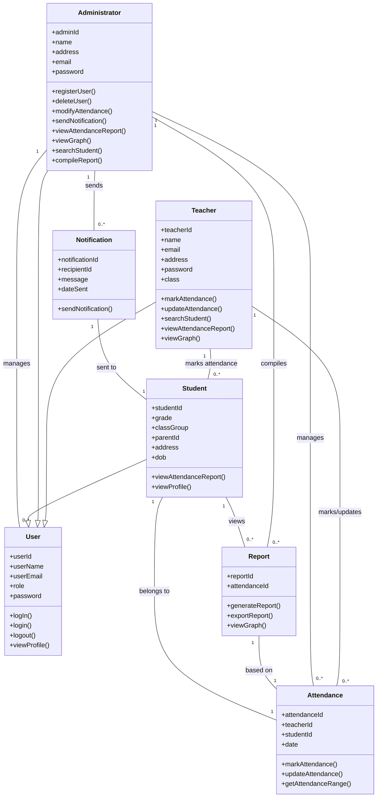
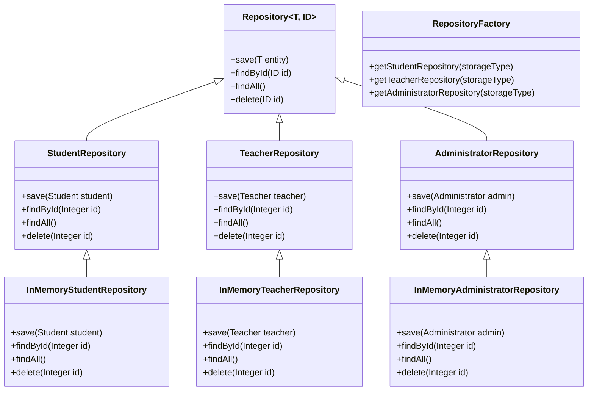

| Entity         | Attributes                                       | Methods                                                              | Relationships | Business Rule |
|----------------|--------------------------------------------------|----------------------------------------------------------------------|---------------|----------------|
| User           | userId, userName, userEmail, role, password       | logIn(), login(), logout(), viewProfile()                            |               | Users can log and log out of the system. |
| Teacher        | teacherId, name, email, address, password, class  | markAttendance(), updateAttendance(), searchStudent(), viewAttendanceReport(), viewGraph() |               | A Teacher marks Attendance Students. A teacher views Students’ attendance. A teacher can update a Students’ attendance.  A Teacher can mark attendance for 1:N Students. A Teacher can view the Attendance of 0:N Students. A teacher can update the attendance of 0:N students. A Teacher can search for 0:N Students. |
| Administrator  | adminId, name, address, email, password           | registerUser(), deleteUser(), modifyAttendance(), sendNotification(), viewAttendanceReport(), viewGraph(), searchStudent(), compileReport() |               | An Admin can delete Users. An Admin can mark Students’ Attendance. An admin can update a Students’ attendance. An Admin can generate Reports. An Admin can assign User privileges.  An Admin can delete 0:N Users. An Admin can mark attendance for 0:N Students. An Admin can update the attendance of 0:N Students’. An Admin can compile 0:N Reports. An Admin can register 0:N Users. An Admin can assign 0:N privilege to Users. |
| Student        | studentId, grade, classGroup, parentId, address, dob | viewAttendanceReport(), viewProfile()                               |               | A Student can View their Attendance.  A Student can view 0:N reports. |
| Attendance     | attendanceId, teacherId, studentId, date          | markAttendance(), updateAttendance(), getAttendanceRange()           |               | The attendance of Students can be marked. The Attendance of Students can be updated.  1:N Attendance records can be marked by a teacher. 1:N Attendance records can be updated by a teacher. |
| Report         | reportId, attendanceId                           | generateReport(), exportReport(), viewGraph                          |               | Reports can be generated by an Admin.  1:N Reports can be generated by a Admin. |
| Notification   | notificationId, recipientId, message, dateSent   | sendNotification()                                                   |               | Notifications can be sent to Parents.  0:N Notifications can be sent by an Admin. |

## Class Diagram

## Adding Repository Logic

