```mermaid
graph TD;
    Administrator["Administrator"];
    Teacher["Teacher"];
    Parent["Parent"];
    Student["Student"];
    Department_of_Education["Department of Education"];
    Principal["Principal"];
    Register_User["Register User"];
    Notifications_Email["Notifications Email"];
    View_Student_Profile["View Student Profile"];
    Search_Student["Search Student"];
    Modify_Attendance["Modify Attendance"];
    Delete_User["Delete User"];
    View_Report["View Report"];
    View_Graph["View Graph"];
    Log_In_Out["Log In/Out"];
    Mark_Attendance["Mark Attendance"];

    Teacher --> Mark_Attendance;
    Teacher --> View_Report;
    Teacher --> View_Student_Profile;
    Teacher --> Search_Student;
    Teacher --> Modify_Attendance;
    Principal --> View_Report;
    Principal --> View_Graph;
    Administrator --> Register_User;
    Administrator --> Delete_User;
    Administrator --> Log_In_Out;
    Administrator --> Notifications_Email;
    Student --> Log_In_Out;
    Student --> View_Student_Profile;
    Parent --> Notifications_Email;
    Department_of_Education --> View_Report;
    Department_of_Education --> View_Graph;
```

## System Requirements

## User Stories
1. The Teacher actor can initiate the “Mark Attendance” use case, where a student’s attendance will be marked using the system. 

2. The Administrator actor can initiate the “Register User” use case, where users will need to complete a form with their details in order for the Administrator to register them on the system. The Administrator will register users in order to filter and keep unauthorized users from registering and viewing students’ data. 

3. The Administrator actor can initiate the “Delete User” use case, where a identified user is deleted from the system.

4. The Teacher, Principal, Student, Administrator and Parent actors can initiate the "Log In/Log out" out use case in order to have access to the system according to their user privileges. 

5. The Teacher, Principal, Student, Administrator, Parent, Department of Education Department actors are able to initiate the "View Report" use case, in order to view reports about learner attendance. The Education Department actor will also receive reports based on the schedule of the said department. 

6. The Teacher and Administrator actor can initiate the “View Student Profile” use case in order to view a student’s information. This may be used to gain access to the student or their parents contact details in order to contact them. 

7. The Teacher and Administrator actors can initiate the "Search Students" use case in order to search for a specific student in order to view or edit their profile. 

8. The Principal, Administrator and Department of Education can initiate the "View Graph" use case in order to view attendance reports in a graphical manner. 

9.  The Teacher and Administrator actors can initiate the "Modify Attendance" use case in order to modify a student’s attendance if errors may have been made. 

10. The Administrator actor can initiate the "Notifications" use case in order to send notifications about absenteeism patterns or school related notifications to the parents. This use case may also be classified as a temporal event due to the system being able to send reports on a monthly or weekly basis or if an absenteeism pattern has been identified.

## Use Case Specifications
1. Use Case: Mark Attendance 

Actor:  Teacher

Precondition:  Teacher is logged in.

Postcondition:  Students Attendance is marked of the current date 

Basic Flow: 
1.	Teacher logs into the system.
2.	Navigates to the attendance marking section.
3.	Selects the class or student list for the current date.
4.	Marks students as present or absent.
5.	Saves the attendance record.
6.	System updates attendance records.

Alternative Flows:	Exceptions may be that the System is unable to capture attendance, or the teacher selects a future or wrong date.

2. Use Case: Register User

Actor: Administrator

Precondition: Administrator is logged in. 

Postcondition: User profiles are registered, and an email notification is sent to the new with user account details.

Basic flow:
1.	Inputs user details (name, role, contact info, etc.).
2.	Assigns system privileges based on the user role.
3.	Saves the user profile.
4.	System sends an email notification with login credentials.

Alternative Flows:  Username may be in use

3. Use Case: Del User

Actor: Administrator

Precondition: Administrator is logged in. 

Postcondition: User profile has been deleted. 

1.	Searches for the user in the system.
2.	Confirms user deletion.
3.	System removes user and restricts access.

Alternative Flows:  The wrong account may be deleted

4. Use Case: View Report 

Actor: The Teacher, Principal, Student, Administrator, Parent, Department of Education. 

Precondition: User is logged into the system. 

Postcondition: Actor is able to view or download the attendance reports based on their user privileges. 

Basic Flow:
1.	Navigates to the Reports section.
2.	Selects report type.
3.	System retrieves and displays the report.
4.	User can view, download, or print the report based on privileges.

Alternative Flows:  User may not have privileges to view reports.

5. Use Case: View Student Profile 

Actor: Teacher and Administrator 

Precondition: Actor is logged in and has searched for the student

Postcondition: View the Student in questions profile

Basic Flow:
1.	Actor navigates to the student search section.
2.	Inputs search criteria.
3.	System retrieves the student profile.
4.	User selects a student to view full details.

Alternative Flows:  Student of profile not found error.

6. Use Case: Search Students 

Actor: Teacher, Administrator 

Precondition: Actor has logged in

Postcondition: Found the Student's profile in question 

Basic Flow:
1.	Actor navigates to the student search page.
2.	Enters search criteria.
3.	System retrieves and displays matching students.
4.	User selects a student to view profile or attendance records.

Alternative Flows:  Student may not be registered on the system.

7. Use Case: View Graph 

Actor: The Principal, Administrator and Department of Education 

Precondition: Has navigated to the view report use case

Postcondition: A graphical display of attendance patterns. 

Basic Flow:
1.	Actor navigates to the Reports section.
2.	Selects "View Graph" option.
3.	System generates a graph of attendance trends.
4.	User can analyse patterns and export the graph if needed.

Alternative Flows:  No data found error.

8. Use Case: Modify Attendance 

Actor: Teacher and Administrator

Precondition: Actor is logged in. 

Postcondition: Students Attendance has been modified.

Basic Flow:
1.	Actor navigates to the attendance modification page.
2.	Searches for a student or date where correction is needed.
3.	Updates attendance record.
4.	Saves the changes.
5.	System updates attendance records.

Alternative Flows: Teacher may not have permissions set correctly and may be unable to modify.

## Reflection

In regard to the test cases, it becomes difficult to create test cases for some of the functional requirements due to certain cases that may overlap. It is very important to compile requirements in a clear manner and write these requirements for a single case. This is evident especially for the register and delete account requirement. Where they were first put as one-use case but were rather separated into two requirements. In regard to the use case diagram, the diagram is a good method of summarising what the system needs, but it may over simplify the functions of the system. The use case specifications however help to understand the use cases better and what may be needed to achieve these use cases. Documentation is very important and helps you understand what is needed of the system better. This documentation should be complete and be compiled in a manner for all stakeholder in the party to understand, but this may also cause the system to look simpler to the stakeholders than what it would be to achieve when completing it. Documentation however helps make it clearer, what the system wants to achieve and what would be important functions for the system. It helps keeping the requirements within the boundaries of what the system needs, it can go a long way in avoiding scope creep. Making use of a use case diagram also enables the system designers to see all the functions the system needs and with the layout of a use case diagram. It will make it easier to see when a system has too many use cases and will in turn help to scale down the requirements of the system. The diagram may also help to identify subsystems that may be needed. It may help to identify if certain stakeholders have too many privileges in the system and will help designers to manage these privileges better.  In this assignment it displayed that writing down the user stories, helps the designers find a deeper understanding of how the system works and without this documentation it my become difficult to manage expectations later on in the project. Creating test cases may also be a tedious exercise but will help to identify what would be an acceptable criteria for the performance of the system. In completing the test cases it became apart that the Non-Functional tests may sometimes be overlooked and that it may be a good idea to start planning for this as early as possible in the project. If a system is designed without these types of documentation, it may become difficult to plan how the artefact will be delivered. For instance, designing a Gant chart where milestones will need to be tracked. Prior planning will ensure that stakeholders stay in line with the what the system is intended for, and this will keep them from attempting to add unnecessary features. Without this documentation it will be hard to complete future planning in a meaningful and accurate manner. 

