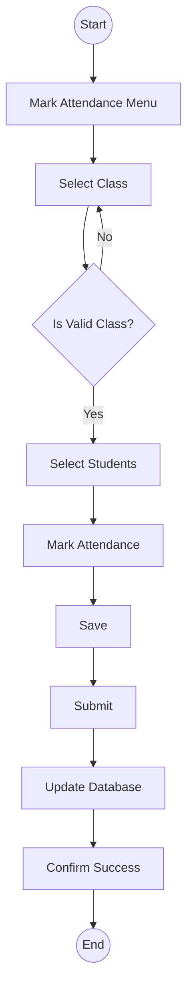
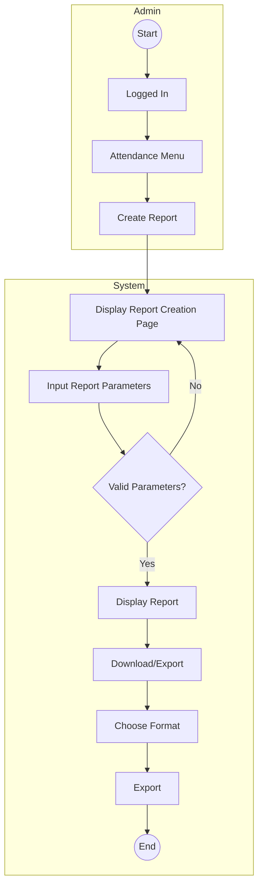

## Activity Diagrams

### Marking Attendance

```mermaid
flowchart TD
    A((Start))
    B[Mark Attendance Menu]
    C[Select Class]
    D{Is Valid Class?}
    E[Select Students]
    F[Mark Attendance]
    G[Save]
    H[Submit]
    I[Update Database]
    J[Confirm Success]
    K((End))
    
    A --> B
    B --> C
    C --> D
    D -- Yes --> E
    D -- No --> C
    E --> F
    F --> G
    G --> H
    H --> I
    I --> J
    J --> K
```

### Create Report 

```mermaid
flowchart TD
    %% Admin Actions
    subgraph Admin [Admin]
      A((Start))
      A --> B[Logged In]
      B --> C[Attendance Menu]
      C --> D[Create Report]
    end

    %% System Processes
    subgraph System [System]
      D --> E[Display Report Creation Page]
      E --> F[Input Report Parameters]
      F --> G{Valid Parameters?}
      G -- Yes --> H[Display Report]
      G -- No --> E
      H --> I[Download/Export]
      I --> J[Choose Format]
      J --> K[Export]
      K --> L((End))
    end
```
