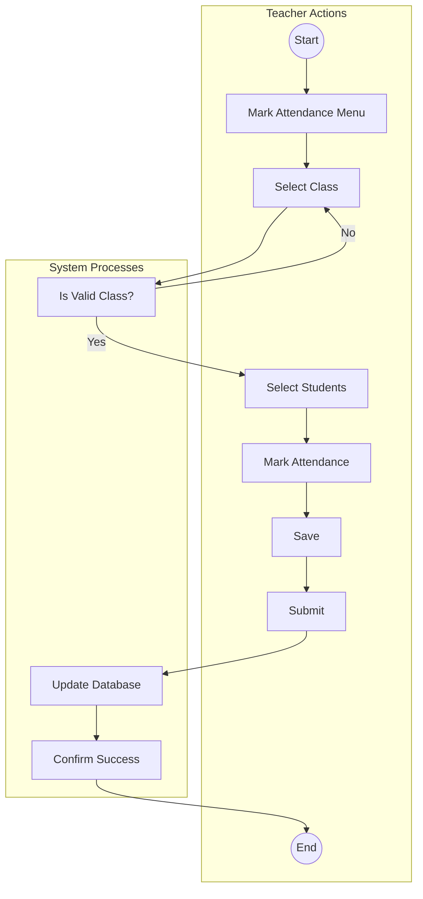
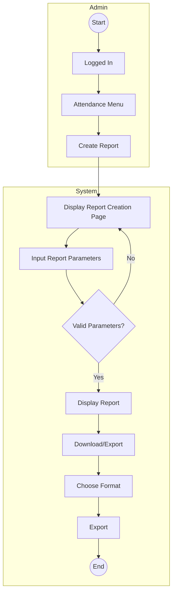
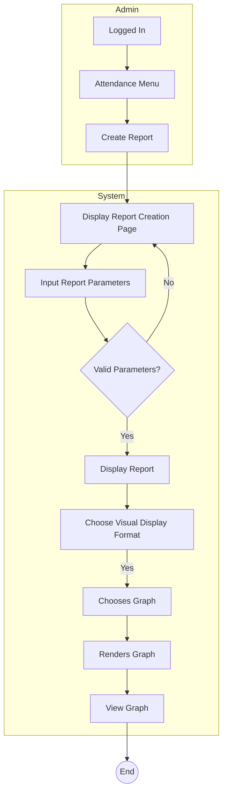
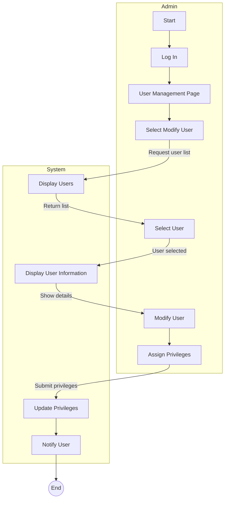
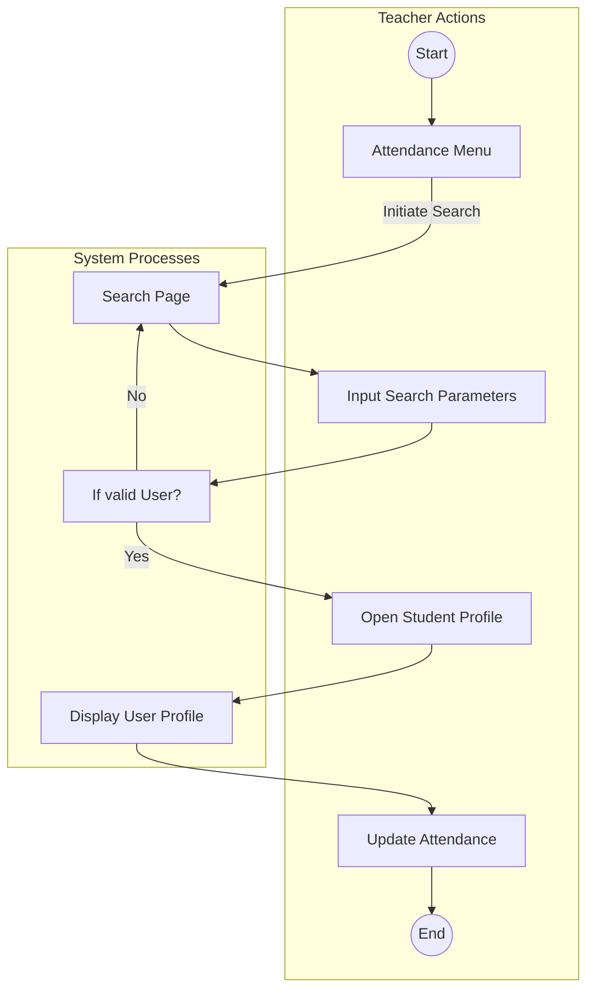

## Activity Diagrams

### Marking Attendance

### Create Report 

## Display Report as a Graph

### Assign Privileges

### Register a New User

### Search for a Student

### Update an Attendance Record

