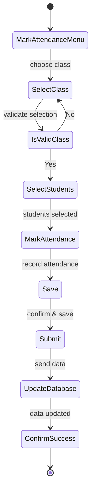
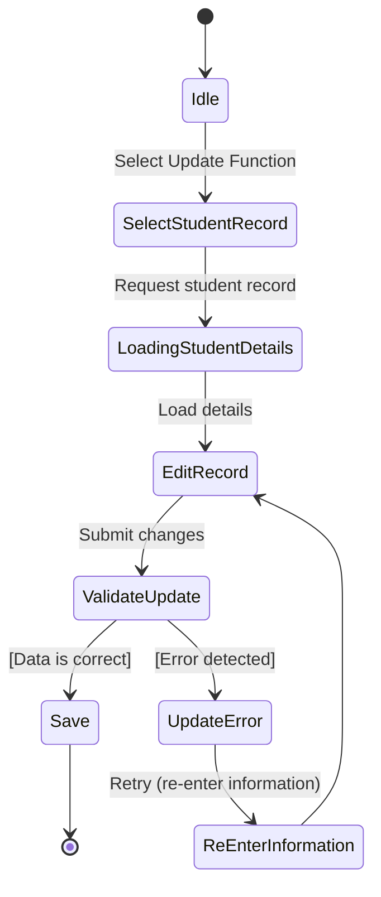
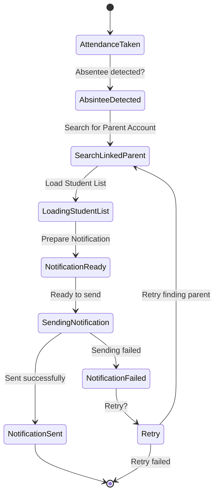
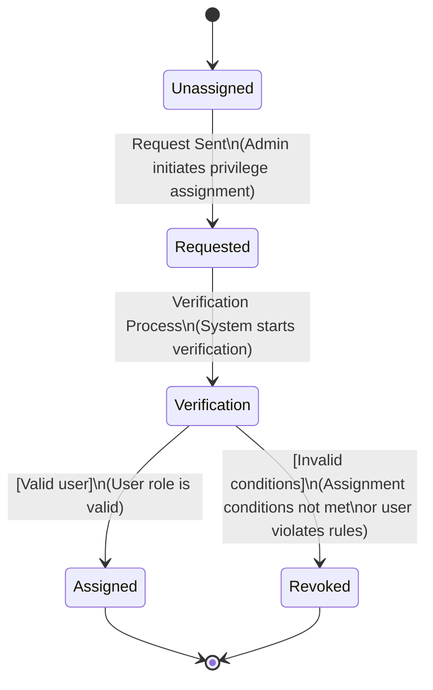
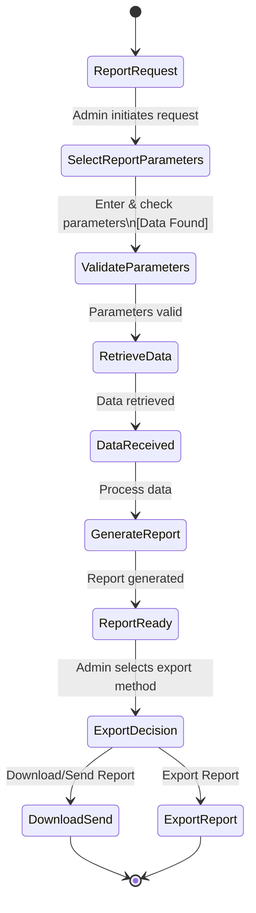
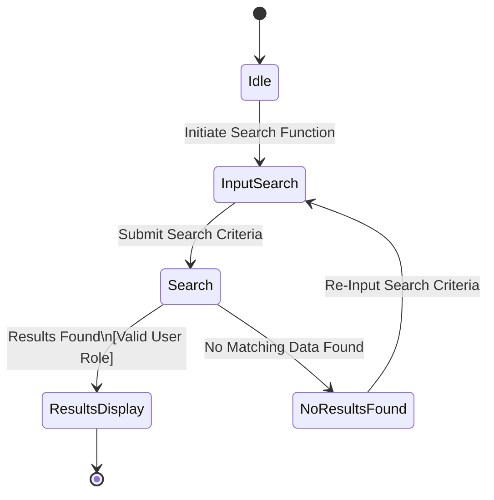
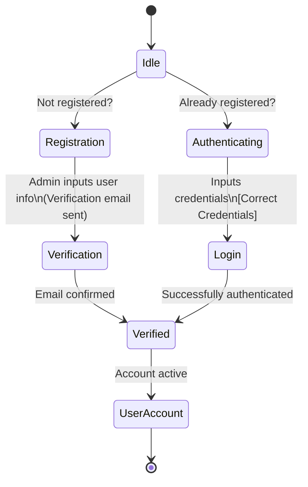
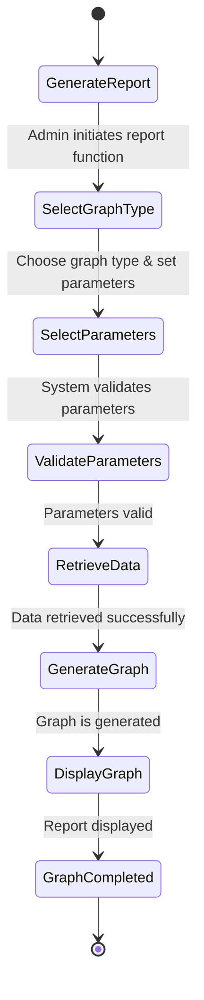

## State Transition Diagrams

### Objects
1. Attendance
2. Modify
3. Notification
4. Privileges
5. Report
6. TeacherSearch
7. UserAccount
8. ViewReport

### Attendance

Important States:
Select Class: The teacher chooses a class for which attendance is to be marked.
Is Valid Class?: A decision state that checks if the selected class is valid.
Mark Attendance: The state where attendance is actually recorded.
Update Database: The system processes the submitted data and updates its records.

Key Transitions:
From class selection, it transitions to “Is Valid Class?” where a Yes branch continues to student selection while a No branch loops back to re‑select a class.
Once students are selected, the teacher marks, saves, and submits the attendance.
The submission triggers a system reaction—updating the database, which then confirms success and terminates the process.

### Modify

Important States:
Idle: The starting state where nothing is happening.
Edit Record: The teacher edits the student’s details.
Validate Update: The system validates the changes submitted by the teacher.
Update Error: If the system detects an error in the update.

Key Transitions:
The teacher then edits the record and submits the changes.
A decision is made in the “Validate Update” state: if the data is correct the process moves to Save (and then ends), otherwise it branches to an error state to allow re‑entry of information before trying again.

### Notification

Important States:
Absentee Detected: The system detects that a student is absent.
Search Linked Parent: The system searches for a linked parent account in relation to the absentee.
Sending Notification: The system attempts to send the notification.
Notification Failed: The notification failed to send.
Key Transitions:
After loading requisite data, the system prepares the notification
A transition occurs from “Sending Notification” to either a “Notification Sent” (success) state or “Notification Failed” (failure)
In the failure branch, the system may allow a retry (which loops back to reattempt the necessary steps) before final termination.

### Privileges

Important States:
Unassigned: The record initially has no privileges assigned.
Verification: The system verifies the privilege request (e.g., by checking user role or other conditions).
Assigned: Privileges are successfully assigned after verification.
Key Transitions:
The process starts at an unassigned state; an assignment request is then sent.
From Verification, if conditions are met (valid user role, etc.), privileges are assigned; otherwise, the privilege remains revoked.

### Report

Important States:
Validate Parameters: The system checks that the parameters are correct (data is found).
Generate Report: The system processes the retrieved data into a report.

Key Transitions:
After parameters are validated, data is retrieved and processed into a report.
Once the report is ready, an export decision is made that branches into the final actions.

### TeacherSearch

Important States:
Search: The system processes the search criteria.
Results Display: If valid results are found (based on a valid user role check), the system displays the results.
No Results Found: If no matching data is found, the teacher is prompted to re‑input search criteria.
Key Transitions:
A decision occurs in the system: if data is found, results are displayed; if not, the process loops back to allow re‑entry of search criteria.

### UserAccount

Important States:
Registration (New User): If the user is not registered, the process branches to registration (admin inputs user info and sends a verification email).
Authenticating (Existing User): If the user is already registered, they log in by providing credentials.
Verified: The state reached after successful registration verification or login authentication.
Key Transitions:
From Idle, the flow splits: non‑registered users follow a Registration route (entering details, receiving verification) while registered users follow an Authentication route (inputting credentials).
Both routes merge into the Verified state and then transition to a final “User Account” (active) state.

### ViewReport

Important States:
Generate Report: The process starts with the admin’s request to generate a report.
Validate Parameters: The system checks that the parameters are valid.
Generate Graph: The system processes the data and generates the graph.
Display Graph: The generated graph is then shown to the admin.
Key Transitions:
The process starts with a report generation request.
The admin selects the graph type and parameters.
The graph is then displayed and the report is considered complete, ending the process.

