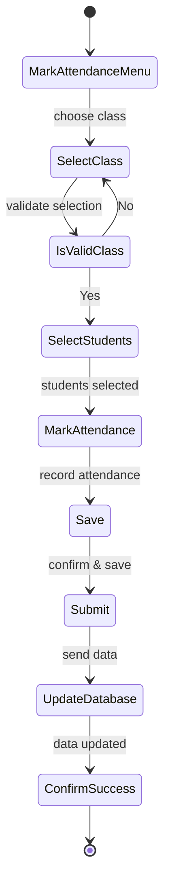

## State Transition Diagrams

### Objects
1. Attendance
2. Modify
3. Notification
4. Privileges
5. Report
6. TeacherSearch
7. UserAccount
8. ViewReport

### Attendance


### Attendance
```mermaid

```
### Modify
```mermaid

```
### Notification
```mermaid

```
### Privileges
```mermaid

```
### Report
```mermaid

```
### TeacherSearch
```mermaid

```
### UserAccount
```mermaid

```
### ViewReport
```mermaid

```
