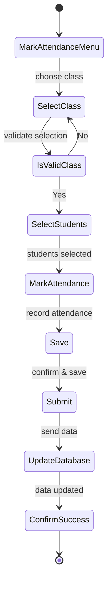
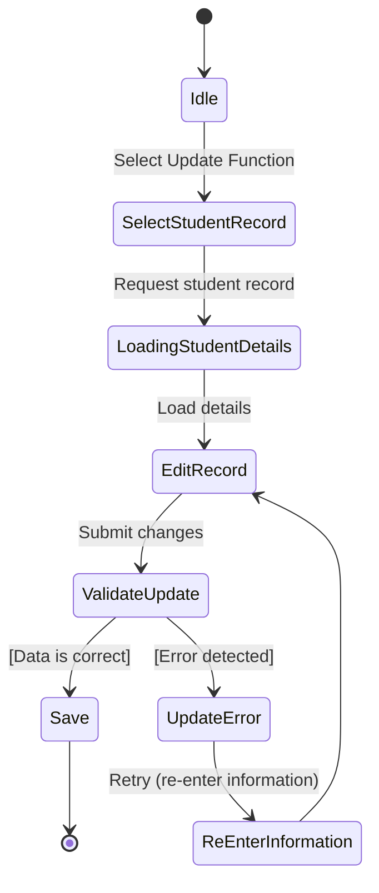
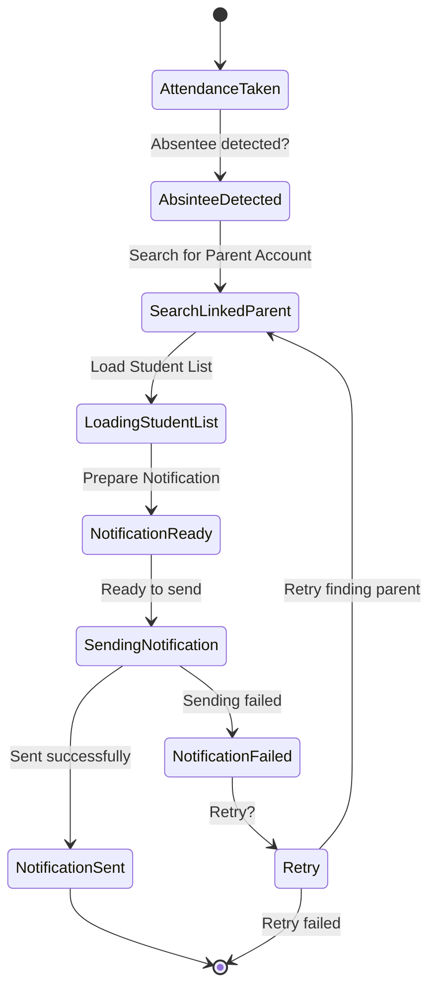
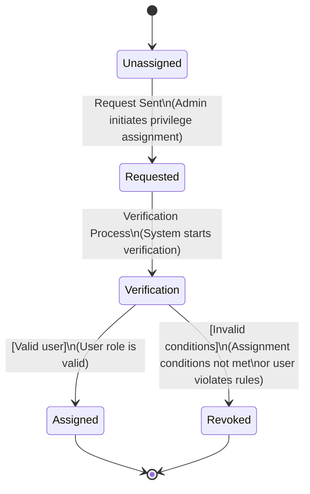
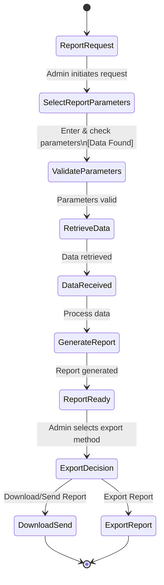
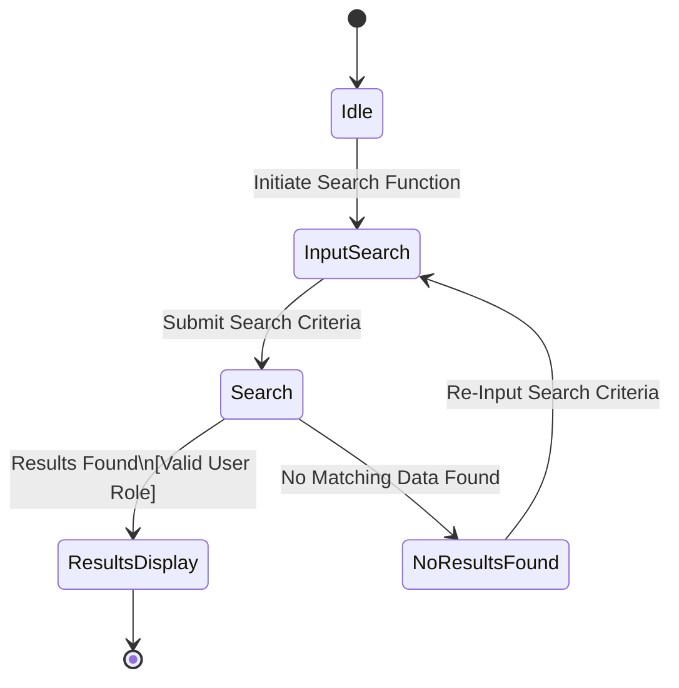
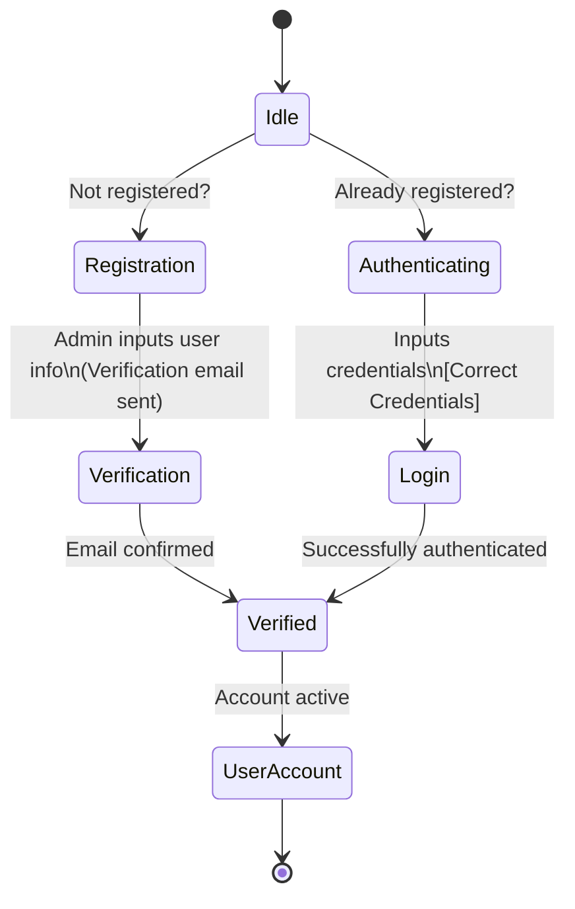
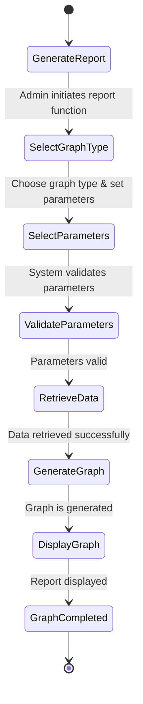

## State Transition Diagrams

### Objects
1. Attendance
2. Modify
3. Notification
4. Privileges
5. Report
6. TeacherSearch
7. UserAccount
8. ViewReport

### Attendance

### Modify

### Notification

### Privileges

### Report

### TeacherSearch

### UserAccount

### ViewReport

